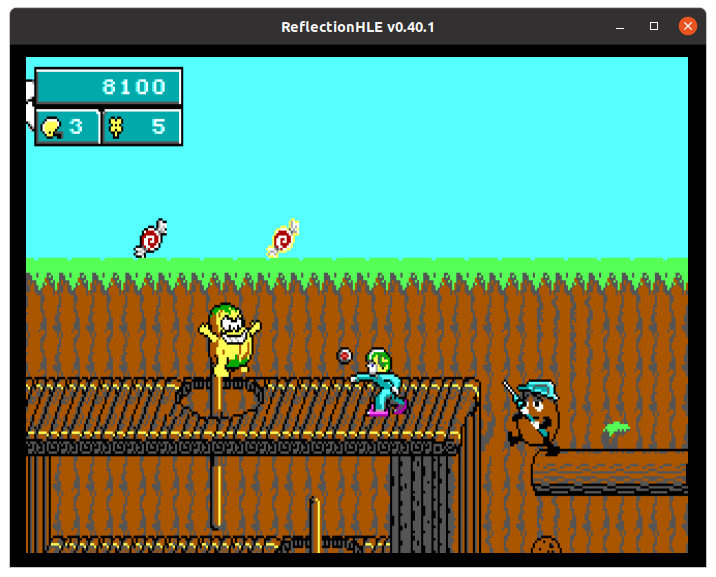
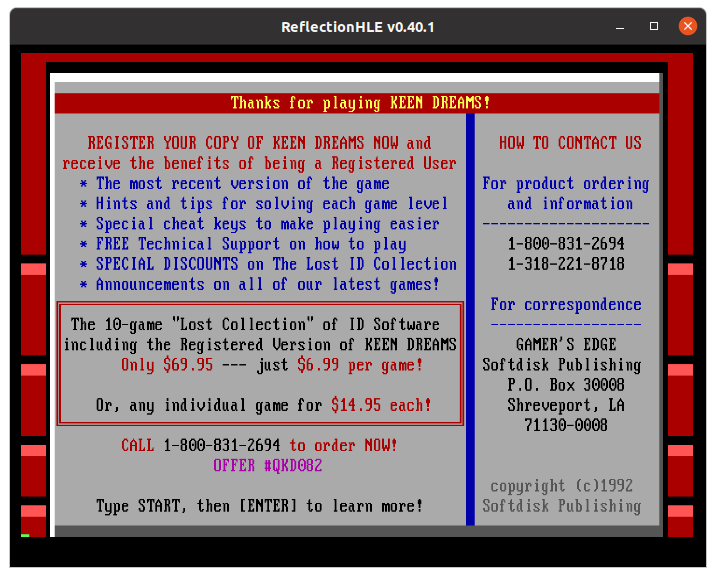
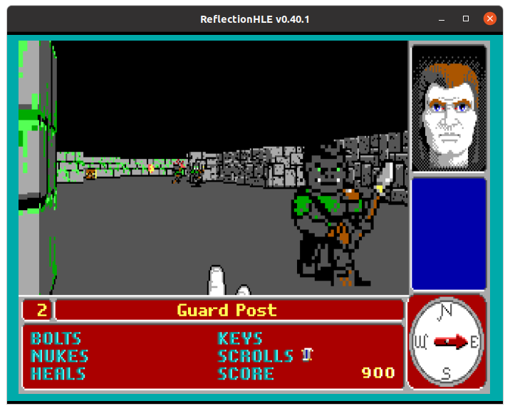
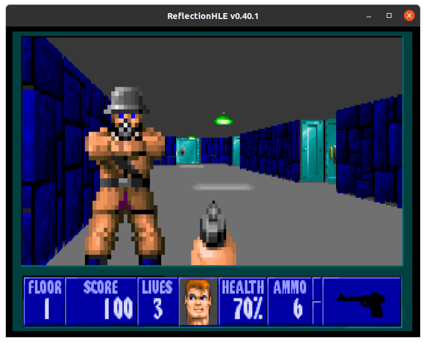
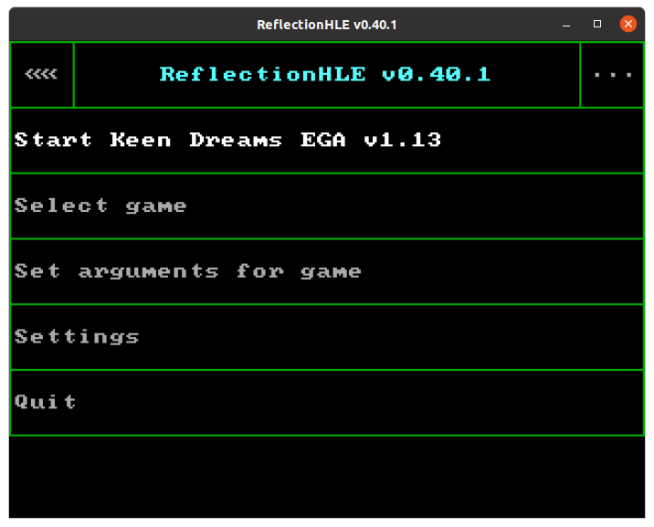

# ReflectionHLE

## [Releases on GitHub](https://github.com/ReflectionHLE/ReflectionHLE/releases/)

1. [About ReflectionHLE](#about)
2. [Supported games](#games)
3. [Features](#features)
4. [Screenshots](#screenshots)

## About ReflectionHLE <a name="about" />

ReflectionHLE is a project consisting of source ports of video games from the 1990s. This project is inspired by [Chocolate Doom](https://www.chocolate-doom.org/wiki/index.php/About), thus the emphasis is on reproducing the experience of playing original DOS versions of the games as they were released.

## Supported games <a name="games" />

* Keen Dreams.
* Catacomb 3-D and the Catacomb Adventure Series.
* Wolfenstein 3D, Spear of Destiny and Super 3-D Noah's Ark (DOS versions).

## Features <a name="features" />

* Play the games as when they were released for DOS, with adaptations for running them on modern platforms.
* For a subset of the games, multiple versions from the 1990s are supported, including behaviors unique to them.
* Support the usage of modern input devices.
* High level emulation of hardware components, as much as should be expected.
* Internal emulation of volume controls, including stereo panning for Wolfenstein 3D.
* Overscan border emulation.
* Text mode emulation.
* Cross-platform support.

## Screenshots <a name="screenshots" />

  
  
  
  
  
